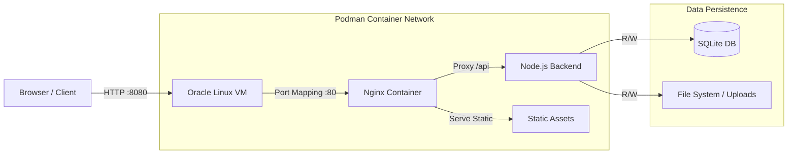
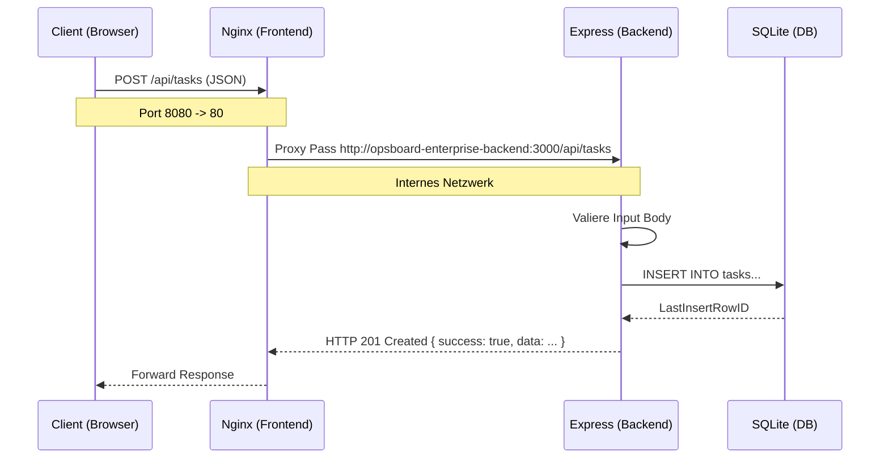
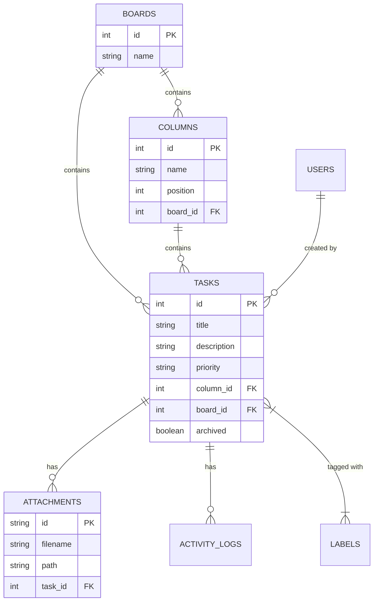
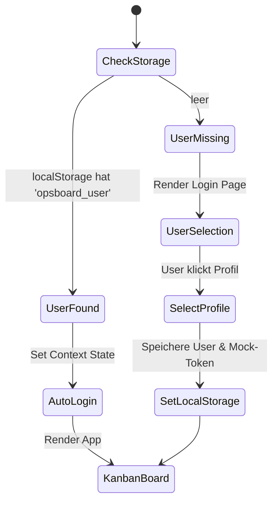
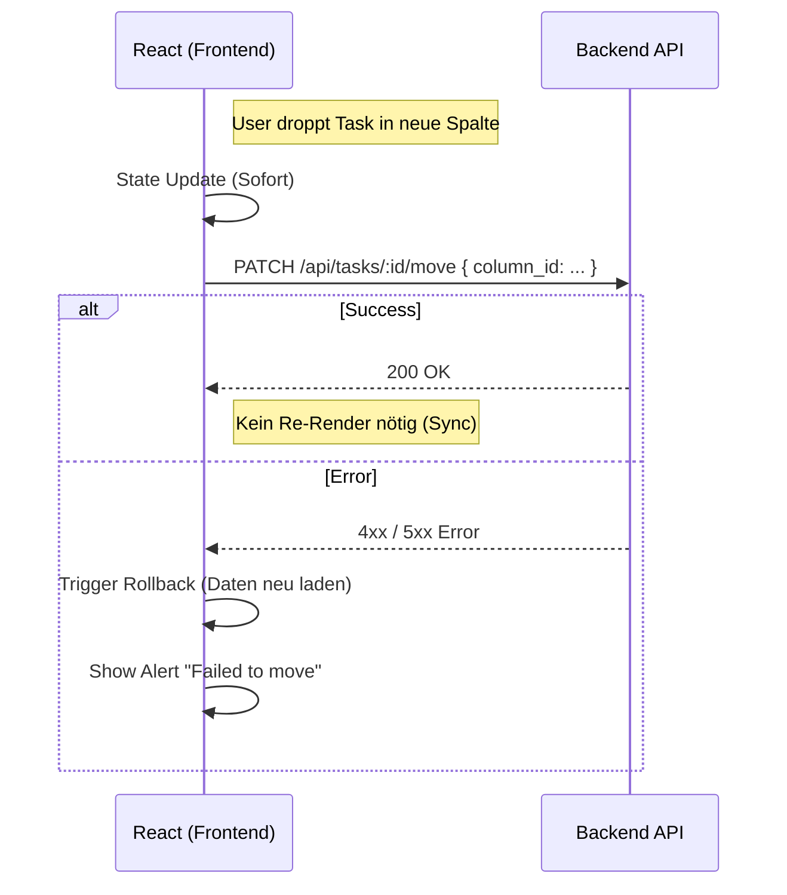

# ARCHITEKTUR-ÜBERSICHT: OPSBOARD ENTERPRISE PLATFORM SYSTEM

Dieses Dokument detailliert die technische Architektur des Kanban-Board-Systems für den Einsatz in einer isolierten Oracle Linux VM Umgebung.

---

## 1. Systemarchitektur (High-Level)

Das System basiert auf einer klassischen **Client-Server-Architektur**, die vollständig in Container gekapselt ist. Der Client (Browser) kommuniziert ausschließlich über HTTP mit dem Reverse Proxy (Nginx), der Anfragen entweder direkt beantwortet (Statische Assets) oder an den Applikationsserver (Backend) weiterleitet.



**Erläuterung:**
*   **Host**: Oracle Linux VM, führt Podman aus.
*   **Frontend**: Nginx dient als Entrypoint, Webserver für React-Dateien und Reverse Proxy.
*   **Backend**: Zustandsloser API-Server (Node.js/Express), verwaltet aber zustandsbehaftete Ressourcen (DB-Datei, Uploads).
*   **Persistenz**: Daten liegen in Docker/Podman Volumes außerhalb der Container-Wegwerf-Layer.

---

## 2. Container-Architektur & Orchestrierung

Die Anwendung wird mittels `podman-compose` als Multi-Container-Applikation orchestriert.

```mermaid
classDiagram
    class Frontend_Container {
        Image: nginx:alpine
        Port: 80 (Internal)
        Mounts: /usr/share/nginx/html
        Config: nginx.conf
    }
    
    class Backend_Container {
        Image: node:18-alpine
        Port: 3000 (Internal)
        Env: DB_PATH, UPLOADS_PATH
        Mounts: /data, /app/uploads
    }
    
    class Host_Volume_Data {
        Name: opsboard-enterprise-data
        Path: /var/lib/containers/...
    }
    
    class Host_Volume_Uploads {
        Name: opsboard-enterprise-uploads
        Path: /var/lib/containers/...
    }
    
    Frontend_Container ..> Backend_Container : "link: opsboard-enterprise-backend"
    Backend_Container --> Host_Volume_Data : "Mounts /data"
    Backend_Container --> Host_Volume_Uploads : "Mounts /app/uploads"
```

---

## 3. Netzwerkfluss (Request Lifecycle)

Der Weg eines API-Aufrufs (z.B. "Task erstellen") durch das System.



---

## 4. Datenbank-Struktur (Entity Relationship)

Relationale Struktur in SQLite.



---

## 5. Authentifizierungs-Flow ("Soft Auth")

Aktuell implementiert das System eine "Soft Authentication" ohne Backend-Verifikation für vertrauenswürdige interne Netze.



*   **Sicherheits-Hinweis**: Das Backend prüft das Token aktuell nicht. Die Sicherheit beruht auf der Netzwerkkapselung.

---

## 6. Drag & Drop Flow (Optimistic UI)

Um eine hohe, desktop-ähnliche Responsivität zu gewährleisten, wird die UI *vor* der Server-Antwort aktualisiert.



---

## 7. File Upload Flow

Der Ablauf beim Hochladen von Anhängen.

```mermaid
flowchart TD
    A[Client: Drag File] --> B[React: FormData erstellen]
    B --> C[POST /api/tasks/:id/attachments]
    C --> D[Nginx Proxy /api]
    D --> E[Express Middleware (Multer)]
    
    subgraph Backend
        E --> F{Size < 50MB?}
        F -- No --> G[Reject 400]
        F -- Yes --> H[Generate UUID Filename]
        H --> I[Save to /data/uploads]
        I --> J[Insert into DB 'attachments']
        J --> K[Return Success JSON]
    end
```

---

## 8. Deployment Architektur

Die physische und logische Verteilung auf dem Produktionsserver.

```
+--------------------------------------------------------+
|  Oracle Linux 8.10 VM                                  |
|  IP: 192.168.x.x                                       |
|                                                        |
|  +---------------------------+                         |
|  | Podman Engine             |                         |
|  |                           |                         |
|  |  +---------------------+  |  Network: opsboard-enterprise    |
|  |  | Container: Frontend | <------------------------> |
|  |  |  (Nginx, Port 80)   |  |   +------------------+  |
|  |  +----------^----------+  |   | Container: Backend| |
|  |             |             |   | (Node, Port 3000)|  |
|  |      Volume: (Read-Only)  |   +---------^--------+  |
|  |      /usr/share/nginx/html|             |           |
|  +-------------^-------------+             |           |
|                |                           |           |
|                |                   Volume: opsboard-enterprise-data |
|         Port 8080:80               Volume: uploads     |
+----------------^---------------------------^-----------+
                 |                           |
            Browser Request             Filesystem
```

---

## 9. Analyse & Bewertung

### Architektur-Stärken
1.  **Isolation**: Saubere Trennung von Frontend, Backend und Daten durch Container.
2.  **Performance**: Nginx liefert statische Inhalte extrem schnell; Backend wird dadurch entlastet.
3.  **Wartbarkeit**: Multi-Stage Dockerfiles sorgen für minimale Image-Größen.
4.  **Resilienz**: Optimistic UI Handling macht Netzwerk-Latenz für den User fast unsichtbar.
5.  **Datenschutz**: Keine externen Cloud-Abhängigkeiten; Daten bleiben auf der VM.

### Architektur-Schwächen
1.  **Auth-Sicherheit**: Fehlende serverseitige Token-Validierung macht das System untauglich für öffentliche Netze.
2.  **Skalierbarkeit**: SQLite ist auf *eine* Schreibinstanz beschränkt. Horizontal Scaling (mehrere Backend-Replicas) ist mit dieser DB-Architektur nicht möglich.
3.  **N+1 Queries**: Das Laden großer Boards ist DB-lastig, da Tasks und Relationen in Schleifen oder separaten Queries geladen werden.

### Skalierbarkeit
*   **Vertikal**: Gut möglich durch Zuweisung von mehr CPU/RAM an die VM/Container.
*   **Horizontal**: Nicht möglich ohne Migration der Datenbank (z.B. auf PostgreSQL Container).

### Empfohlene Weiterentwicklung (Roadmap)
1.  **Phase 1 (Security)**: Integration von Passport.js oder JWT Middleware im Express Backend zur Validierung der User-Requests.
2.  **Phase 2 (Performance)**: Optimierung der SQL-Queries (JOINs statt N+1) im `BoardController`.
3.  **Phase 3 (Enterprise)**: Ablösung von SQLite durch PostgreSQL Container, falls >100 User erwartet werden.
