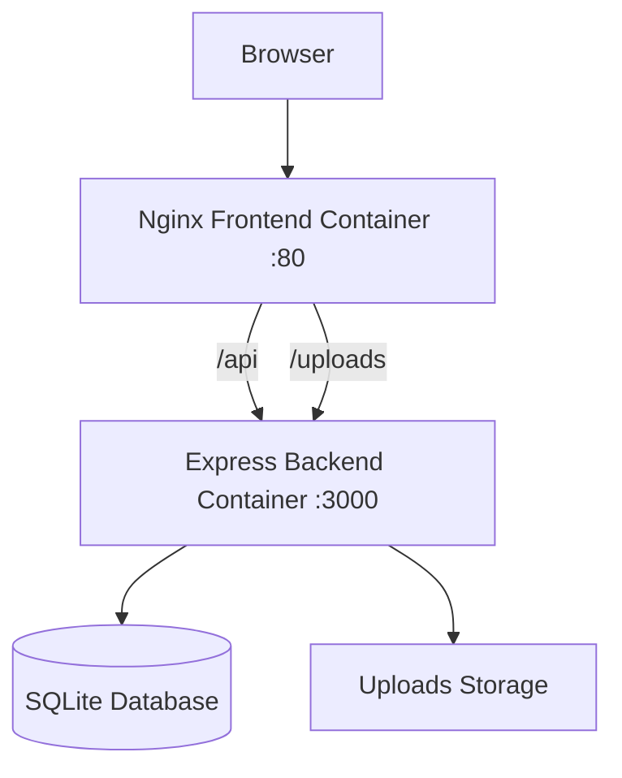

# OpsBoard - Enterprise Platform


A production-focused, self-hosted Kanban platform for internal teams with a modern React UI, a lightweight Express API, SQLite persistence, and container-first deployment.

## Hero

Build and run a complete task workflow stack in minutes:
- Fast SPA frontend with smooth drag-and-drop Kanban interactions
- Reliable backend with file attachments, labels, archive workflows, and activity logs
- Simple operations via Docker Compose, Podman Compose, or Portainer Stack deployment

## Feature Overview

- ✅ **Multi-board Kanban** with customizable columns
- 🧲 **Drag & drop** task movement with optimized UX
- 🏷️ **Label system** (create, assign, remove)
- 📎 **File attachments** per task (up to 50 MB)
- 🗃️ **Archive/restore** task lifecycle
- 🕓 **Activity log** for task history
- 🔎 **Search and filtering** across board content
- 🌐 **Containerized deployment** with Nginx reverse proxy

## Architecture



### Components

- **Frontend**: React 18 + Vite + Tailwind CSS (`frontend/`)
- **Backend**: Node.js + Express + better-sqlite3 (`backend/`)
- **Database**: SQLite file (`database.sqlite`)
- **Serving/Proxy**: Nginx serves static assets and proxies `/api` + `/uploads`
- **Containers**: `docker-compose.yml` and `podman-compose.yml`

## Quick Start

### Prerequisites

- Node.js `18+`
- npm
- Docker + Docker Compose **or** Podman + Podman Compose

### Local Development (without containers)

1. Start backend:

```bash
cd backend
npm ci
npm run dev
```

2. Start frontend (new terminal):

```bash
cd frontend
npm ci
npm run dev
```

3. Open:

- Frontend: `http://localhost:5173`
- Backend: `http://localhost:3000`

Vite dev proxy forwards `/api` and `/uploads` to the backend.

## Container Deployment

### Docker Compose

```bash
cp .env.production.example .env
# adjust values in .env if needed

docker compose up -d --build
```

Open `http://localhost:9010` (default).

### Podman Compose

```bash
cp .env.production.example .env
# adjust values in .env if needed

podman-compose -f podman-compose.yml up -d --build
```

Open `http://localhost:9010` (default).

### Portainer (Stack)

1. Go to **Stacks** -> **Add stack**
2. Paste content from `docker-compose.yml`
3. Define environment values in Portainer UI:
   - `FRONTEND_HOST_PORT`
   - `BACKEND_HOST_PORT`
   - `CORS_ORIGIN`
4. Deploy stack
5. Open `http://<server-ip>:<FRONTEND_HOST_PORT>`

## Environment Variables

| Variable | Scope | Default | Description |
|---|---|---|---|
| `PORT` | Backend | `3000` | Backend internal listen port |
| `NODE_ENV` | Backend | `production` | Runtime mode |
| `DB_PATH` | Backend | `/data/database.sqlite` or local fallback | SQLite file location |
| `UPLOADS_PATH` | Backend | `/app/data/uploads` or local fallback | Upload directory |
| `CORS_ORIGIN` | Backend | `http://localhost:9010` | Allowed browser origin for backend CORS |
| `FRONTEND_HOST_PORT` | Compose | `9010` | Host port mapped to frontend container `80` |
| `BACKEND_HOST_PORT` | Compose | `9015` | Host port mapped to backend container `3000` |
| `VITE_API_URL` | Frontend build | `/api` (fallback) | Optional absolute API base URL |
| `VITE_WEATHER_CITY` | Frontend build | `Frankfurt am Main` | Default weather city |
| `VITE_DISABLE_BOOT_ANIMATION` | Frontend build | `false` | Disable startup animation when `true` |
| `VITE_BOOT_DEBUG` | Frontend build | `false` | Enable boot debug mode in development |

## Port Configuration

Default production-style host mapping:

- Frontend: `9010 -> container:80`
- Backend: `9015 -> container:3000`

Example `.env`:

```env
FRONTEND_HOST_PORT=9010
BACKEND_HOST_PORT=9015
CORS_ORIGIN=http://localhost:9010
```

If you change frontend host port, update `CORS_ORIGIN` accordingly.

## Production Deployment Guide

1. Copy `.env.production.example` to `.env`
2. Set public host/IP values (`CORS_ORIGIN`, ports)
3. Start with compose (`docker compose up -d --build` or `podman-compose ...`)
4. Validate health and connectivity:

```bash
# backend health
curl http://localhost:9015/health

# frontend entry
curl -I http://localhost:9010
```

5. Observe logs:

```bash
docker compose logs -f
# or
podman logs -f opsboard-enterprise-backend
podman logs -f opsboard-enterprise-frontend
```

6. Back up persistent data regularly:
- Docker setup: `backend/data/`
- Podman setup: named volumes `opsboard-enterprise-data`, `opsboard-enterprise-uploads`

## Screenshots


## Project Structure

```text
.
├── backend/
│   ├── src/
│   │   ├── controllers/
│   │   ├── jobs/
│   │   ├── middleware/
│   │   ├── routes/
│   │   ├── db.js
│   │   └── server.js
│   ├── data/
│   ├── Dockerfile
│   └── Containerfile
├── frontend/
│   ├── public/
│   ├── src/
│   │   ├── components/
│   │   ├── context/
│   │   ├── pages/
│   │   └── services/
│   ├── nginx.conf
│   ├── Dockerfile
│   └── Containerfile
├── docker-compose.yml
├── podman-compose.yml
├── .env.production.example
├── DEPLOYMENT.md
└── ARCHITECTURE_DIAGRAM.md
```

## API Overview

Base path: `/api`

### Users
- `GET /users`
- `POST /users`
- `DELETE /users/:id`

### Boards & Columns
- `GET /boards`
- `POST /boards`
- `DELETE /boards/:id`
- `PUT /boards/:id`
- `GET /boards/:id`
- `POST /columns`
- `PUT /columns/:id`
- `DELETE /columns/:id`
- `POST /columns/reorder`

### Tasks
- `POST /tasks`
- `PUT /tasks/:id`
- `DELETE /tasks/:id`
- `GET /tasks/:id`
- `PATCH /tasks/:id/move`
- `PATCH /tasks/:id/archive`
- `PATCH /tasks/:id/restore`
- `GET /archived-tasks`

### Labels
- `GET /labels`
- `POST /labels`
- `DELETE /labels/:id`
- `POST /tasks/:id/labels`
- `DELETE /tasks/:id/labels/:labelId`

### Attachments
- `POST /tasks/:id/attachments`
- `DELETE /tasks/:id/attachments/:attachmentId`

### Health
- `GET /health` (backend root path)

## Security Notes

- Current user login is lightweight and oriented to trusted internal networks.
- Backend CORS is restricted by `CORS_ORIGIN`.
- Uploads are served with `Content-Disposition: attachment` and `X-Content-Type-Options: nosniff`.
- For internet-facing environments, place a hardened reverse proxy in front and add robust authentication/authorization.

## License

No license file is currently included in this repository (`LICENSE` not present).
For public distribution, add a license file (for example MIT or Apache-2.0).

## Roadmap (Optional)

- [ ] Add server-side auth (JWT/session validation)
- [ ] Add RBAC/permissions
- [ ] Improve board-detail query performance for very large datasets
- [ ] Add test suite coverage for critical API flows
- [ ] Add optional PostgreSQL backend profile
